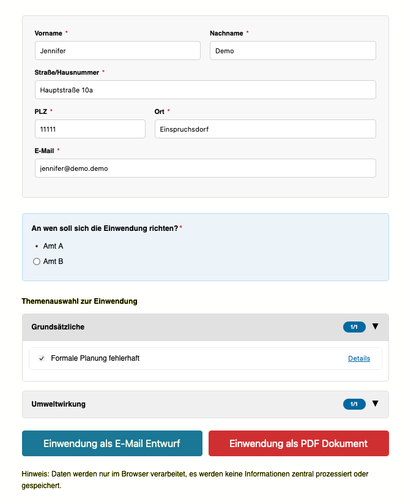
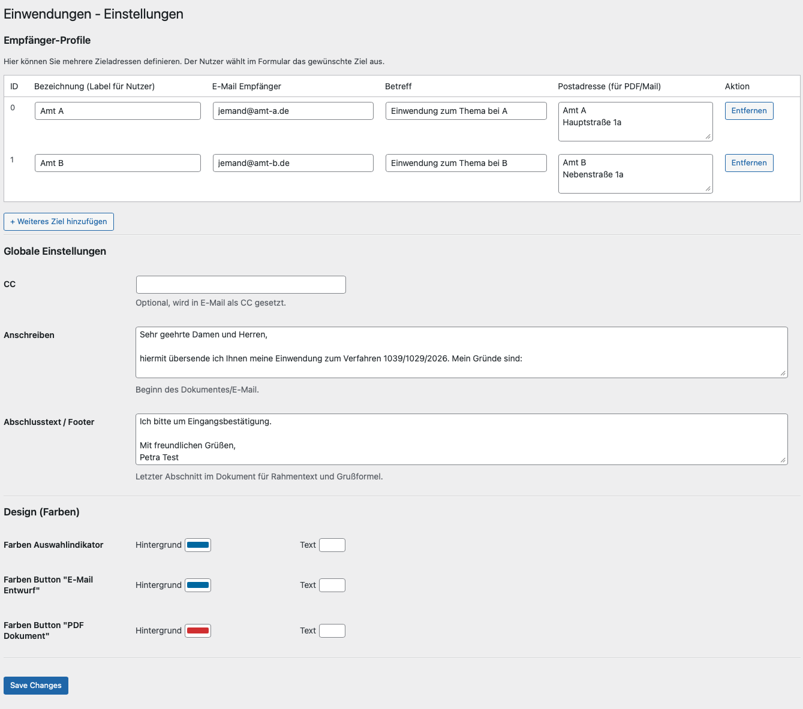
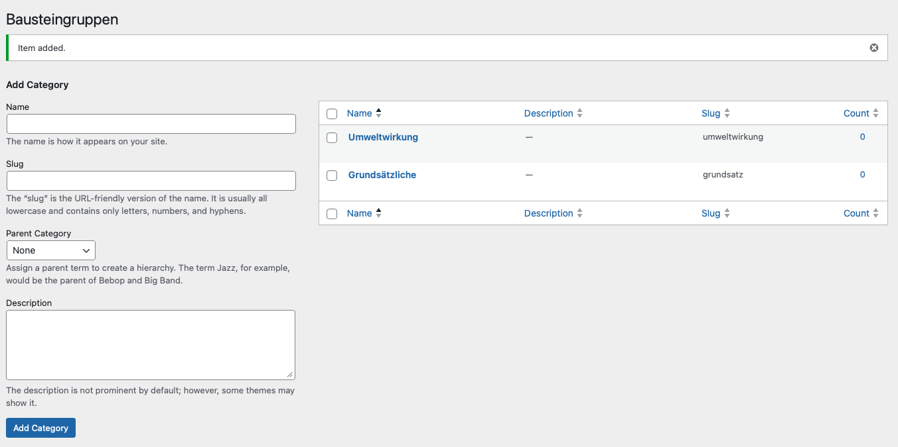
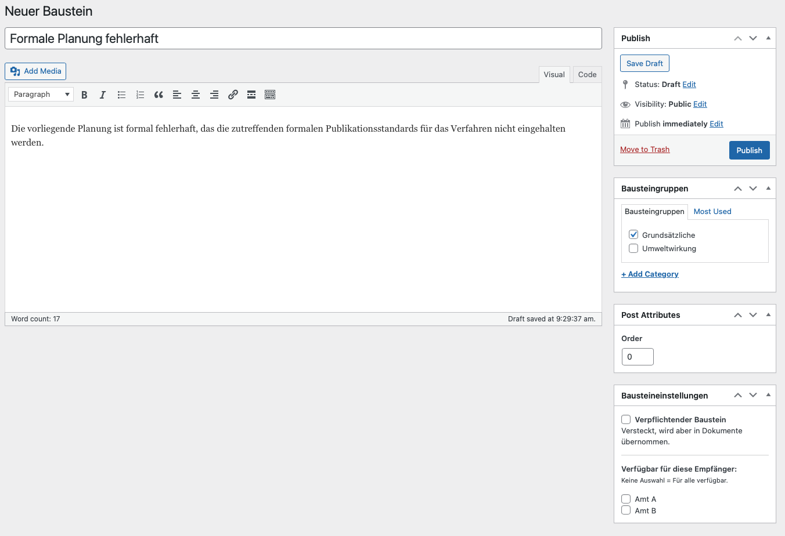

# Easy Einwendung – WordPress Plugin

## Idee & Ziel

Easy Einwendung unterstützt Bürgerinitiativen dabei, **rechtliche Einwendungen schnell, verständlich und skalierbar** nutzbar zu machen. Statt jedes Mal bei null zu beginnen, können **Textbausteine** und **Vorlagen** strukturiert gepflegt, mit wenigen Angaben personalisiert und anschließend als **E-Mail-Entwurf** und/oder **PDF-Dokument** ausgegeben werden.

Das Ziel: Engagierte Menschen sollen auch **ohne juristische Vorkenntnisse** formal saubere und inhaltlich stimmige Einwendungen erstellen können – einzeln oder in großer Zahl. So wird Beteiligung einfacher, Prozesse werden transparenter und Initiativen können Unterstützende effizient mobilisieren, ohne dass Qualität und Nachvollziehbarkeit leiden.

---

## Installation

### Manuell (ZIP-Upload)

1. Lade die neueste Version aus dem Ordner **Builds** herunter:  
   `Builds/Easy-Einwendung-PlugIn-Latest.zip`  
   **Wichtig:** Die ZIP-Datei **nicht** entpacken.

2. Öffne den WordPress-Adminbereich und gehe zu:  
   **Plugins → Installieren**

3. Klicke auf **„Plugin hochladen“**, wähle die ZIP-Datei aus und installiere sie.

4. Anschließend das Plugin **aktivieren**.

---

## Einrichtung & Pflege

### Einbindung per Shortcode

Die Zusammenstellungsansicht kann in jede Seite oder jeden Beitrag per Shortcode eingebunden werden:

[einwendung_baukasten]

---

## Einstellungen

### Globale Einstellungen (Anschreiben, Footer, Design)

Allgemeine Vorgaben für die Ausgabe lassen sich hier pflegen:

**Einwendungsbausteine → Einstellungen** (Menü: „Einwendungen – Einstellungen“)

- **CC** (optional; wird in E-Mails als CC gesetzt)
- **Anschreiben** (Standard-Intro für E-Mail und PDF)
- **Abschlusstext / Footer** (Standard-Schlusssatz + Grußformel)
- **Design (Farben)** (Indikatoren und Buttons)

---

### Versandziele / Empfängerprofile

Hier definierst du, an wen sich die Einwendung richten kann (z. B. unterschiedliche Ämter oder Behörden):

**Einwendungsbausteine → Einstellungen** (Menü: „Einwendungen – Einstellungen“)

Unter **Empfänger-Profile** je Ziel anlegen:

- **Bezeichnung (Label)**: z. B. „Amt A“
- **E-Mail-Empfänger**: z. B. `jemand@amt-a.de`
- **Betreff**: z. B. „Einwendung zum Verfahren …“
- **Postadresse (für PDF/Mail)**: Anschrift des Empfängers

---

## Inhalte

### Bausteingruppen (Themenblöcke)

Textbausteine können in Gruppen organisiert werden. Diese Gruppen erscheinen später im Formular als aufklappbare Themenbereiche.

**Einwendungsbausteine → Bausteingruppen**

- Gruppen als Kategorien anlegen (z. B. „Grundsätzliches“, „Umweltwirkung“)

---

### Bausteine (Textinhalte)

Die eigentlichen Textbausteine werden hier erstellt und gepflegt:

**Einwendungsbausteine → Erstellen** (Neuer Baustein)

- **Titel**: erscheint im Formular als Checkbox-Text
- **Inhalt**: Text, der in die Einwendung übernommen wird

Rechts im Seitenbereich zuweisen/konfigurieren:

- **Bausteingruppen** auswählen (wo der Baustein im Formular einsortiert wird)
- **Bausteineinstellungen**
  - **Verpflichtender Baustein**: wird automatisch übernommen und ist im Formular nicht auswählbar
  - **Verfügbar für diese Empfänger**: nur aktivieren, wenn der Baustein ausschließlich für bestimmte Ziele gelten soll  
    *(Keine Auswahl = für alle Empfänger verfügbar.)*

Anschließend **Speichern/Veröffentlichen**.

